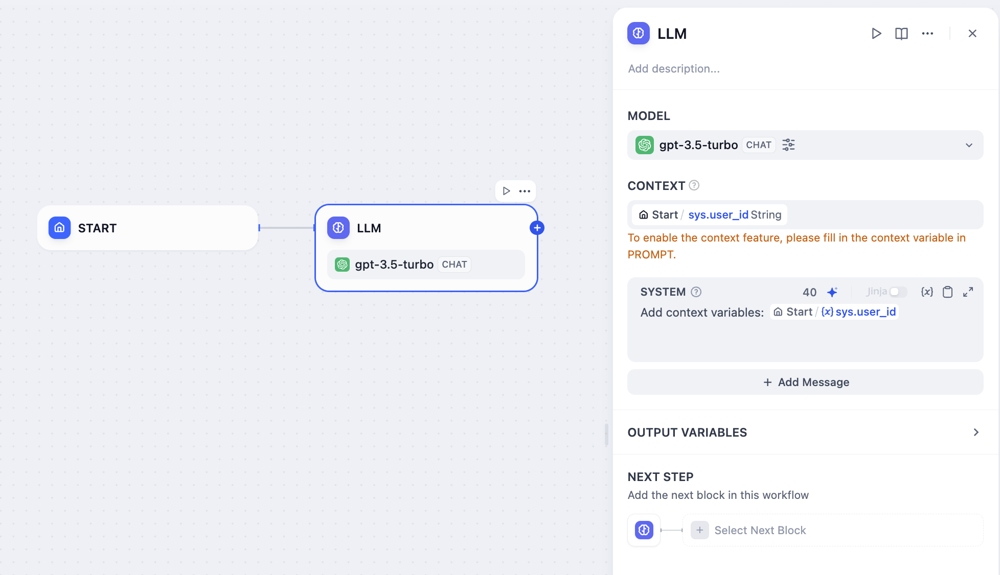
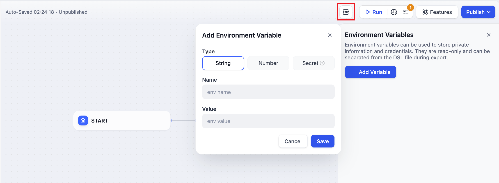

# Key Concepts

### Nodes

**Nodes are the key components of a workflow**. By connecting nodes with different functionalities, you can execute a series of operations within the workflow.

For core workflow nodes, please refer to [Node Description](node/).

***

### Variables

**Variables are used to link the input and output of nodes within a workflow**, enabling complex processing logic throughout the process.

* A workflow needs to define execution start variables, such as defining an input variable `sys.query` for a chatbot.
* Nodes generally need to define input variables, such as defining the input variable for a question classifier as `sys.query`.
* When referencing variables, only upstream node variables in the process can be referenced.
* To avoid variable name conflicts, node names must be unique.
* The output variables of nodes are generally system-fixed variables and cannot be edited.

***

### Environment Variables

**Environment variables are used to protect sensitive information involved in workflows**, such as API keys and database passwords used when running workflows. They are stored in the workflow rather than in the code, allowing them to be shared across different environments.

Supports the following 3 data types:

- String
- Number
- Secret

Environmental variables have the following characteristics:

- Environment variables can be globally referenced within most nodes;
- Environment variable names cannot be duplicated;
- Output variables of nodes are generally read-only and cannot be written to.

***

### Conversation Variables

> Conversation variables are only applicable to [Chatflow](#chatflow-and-workflow) App.

**Conversation variables allow application developers to specify particular information that needs to be temporarily stored within the same Chatflow session, ensuring that this information can be referenced across multiple rounds of chatting within the current chatflow**. This can include context, files uploaded to the chatting box(coming soon), user preferences input during the conversation, etc. It's like providing a "memo" for the LLM that can be checked at any time, avoiding information bias caused by LLM memory errors.

For example, you can store the language preference input by the user in the first round of chatting in a conversation variable. The LLM will refer to the information in the conversation variable when answering and use the specified language to reply to the user in subsequent chats.

<figure><figcaption></figcaption></figure>

**Conversation variables** support the following six data types:

* String
* Number
* Object
* Array[string]
* Array[number]
* Array[object]

**Conversation variables** have the following features:

* Conversation variables can be referenced globally within most nodes in the same Chatflow App;
* Writing to conversation variables requires using the [Variable Assigner](https://docs.dify.ai/guides/workflow/node/variable-assignment) node;
* Conversation variables are read-write variables;

About how to use conversation variables with the Variable Assigner node, please refer to the [Variable Assigner](node/variable-assignment.md).

---

### Chatflow and Workflow

**Application Scenarios**

* **Chatflow**: Designed for conversational scenarios, including customer service, semantic search, and other conversational applications that require multi-step logic in response construction.
* **Workflow**: Geared towards automation and batch processing scenarios, suitable for high-quality translation, data analysis, content generation, email automation, and more.

**Usage Entry Points**

<figure><figcaption>
Chatflow Entry
</figcaption></figure>

<figure><figcaption>
Workflow Entry
</figcaption></figure>

**Differences in Available Nodes**

1. The End node is an ending node for Workflow and can only be selected at the end of the process.
2. The Answer node is specific to Chatflow, used for streaming text output, and can output at intermediate steps in the process.
3. Chatflow has built-in chat memory (Memory) for storing and passing multi-turn conversation history, which can be enabled in nodes like LLM and question classifiers. Workflow does not have Memory-related configurations and cannot enable them.
4. Built-in variables for Chatflow's start node include: `sys.query`, `sys.files`, `sys.conversation_id`, `sys.user_id`. Built-in variables for Workflow's start node include: `sys.files`, `sys_id`.