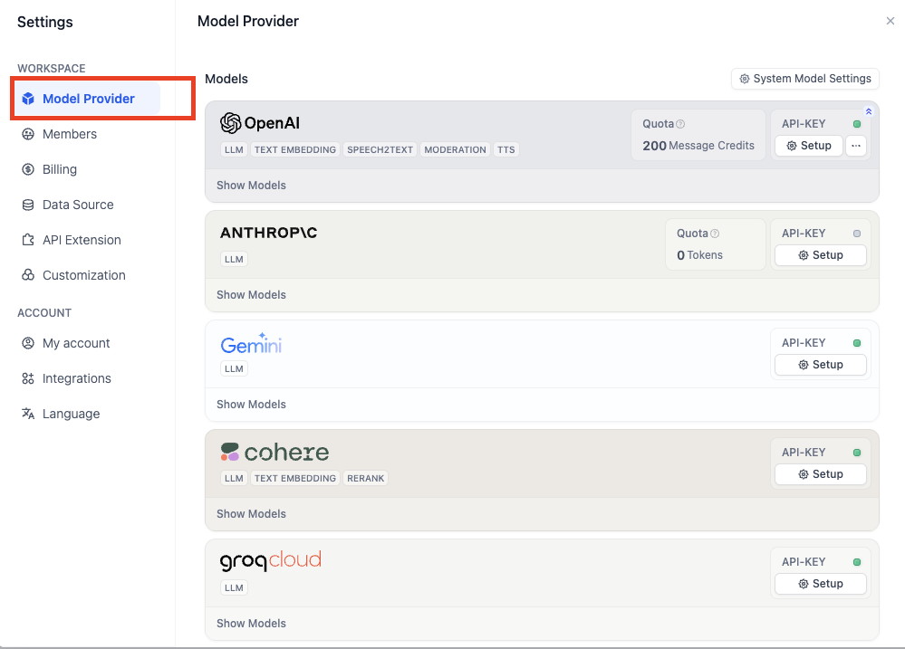
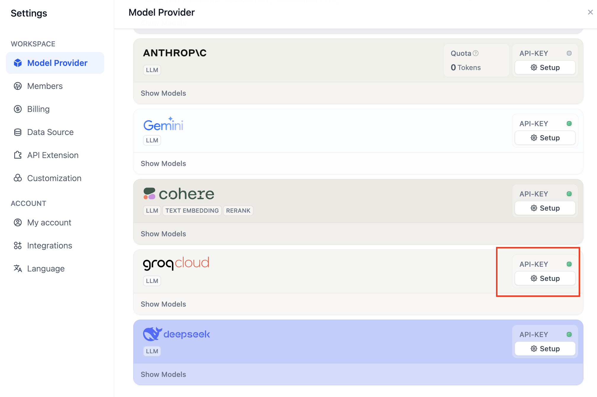
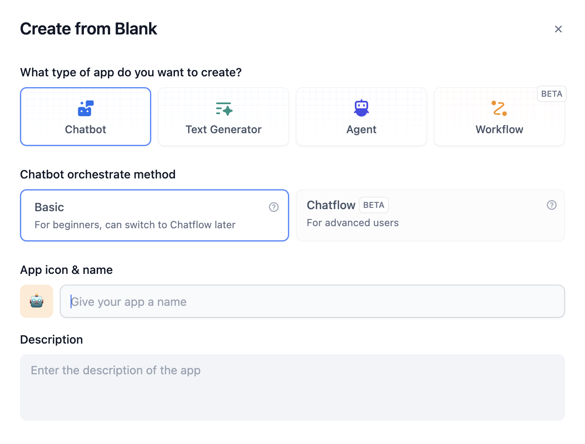
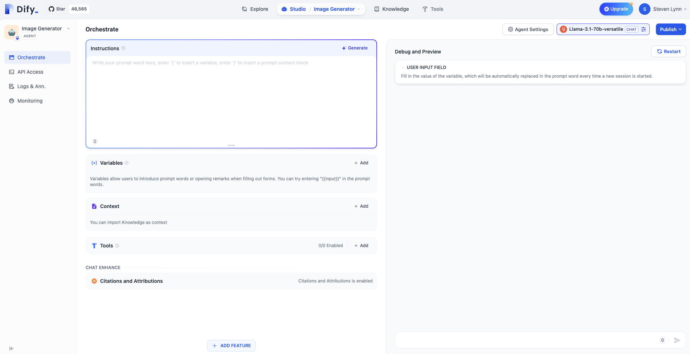
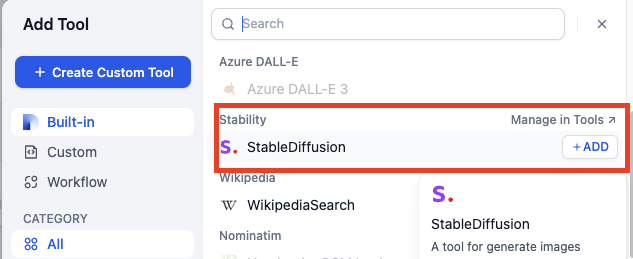
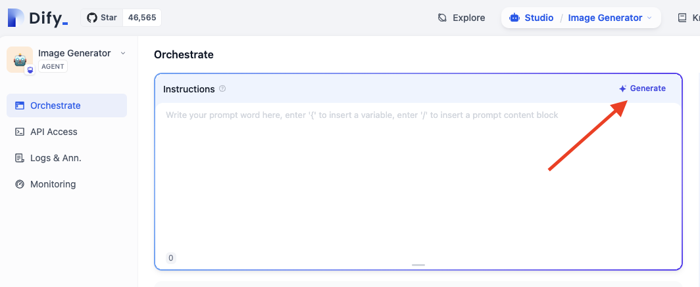
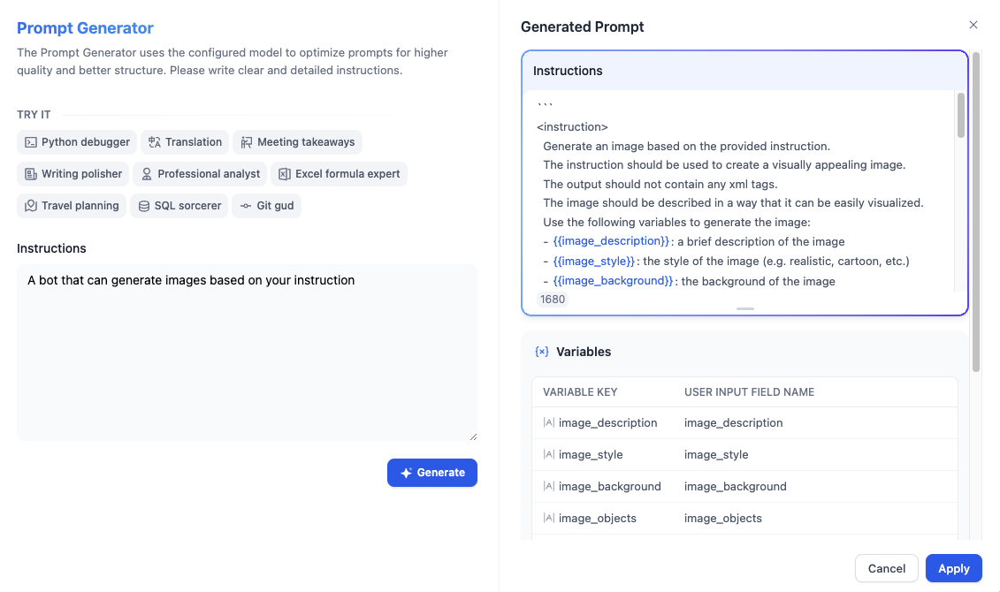
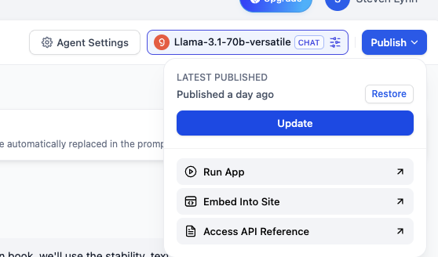

# How to Build an AI Image Generation App

> Author: Steven Lynn. Dify Technical Writer.

With the rise of image generation, many excellent image generation products have emerged, such as Dall-e, Flux, Stable Diffusion, etc.

In this article, you will learn how to develop an AI image generation app using Dify.


## You Will Learn

* Methods for building an Agent using Dify
* Basic concepts of Agent
* Fundamentals of prompt engineering
* Tool usage
* Concepts of large model hallucinations

## 1. Setting Stablility API Key

[Click here](https://platform.stability.ai/account/keys) to go to the Stability API key management page.

If you haven't registered yet, you will be asked to register before entering the API management page.

After entering the management page, click `copy` to copy the key.


Next, you need to fill in the key in [Dify - Tools - Stability](https://cloud.dify.ai/tools) by following these steps:

* Log in to Dify
* Enter Tools
* Select Stability
* Click `Authorize`

&#x20;

* Fill in the key and save

## 2. Configure Model Providers

To optimize interaction, we need an LLM to concretize user instructions, i.e., to write prompts for generating images. Next, we will configure model providers in Dify following these steps.

The Free version of Dify provides 200 free OpenAI message credits.

If the message credits are insufficient, you can customize other model providers by following the steps in the image below:

Click **Your Avatar - Settings - Model Provider** 

If you haven't found a suitable model provider, the groq platform provides free call credits for LLMs like Llama.

Log in to [groq API Management Page](https://console.groq.com/keys)

Click **Create API Key**, set a desired name, and copy the API Key.

Back to **Dify - Model Providers**, select **groqcloud**, and click **Setup**.



Paste the API Key and save.


## 3. Build an Agent

Back to **Dify - Studio**, select **Create from Blank**.


In this experiment, we only need to understand the basic usage of Agent.


**What is an Agent**

An Agent is an AI system that simulates human behavior and capabilities. It interacts with the environment through natural language processing, understands input information, and generates corresponding outputs. The Agent also has "perception" capabilities, can process and analyze various forms of data, and can call and use various external tools and APIs to complete tasks, extending its functional scope. This design allows the Agent to handle complex situations more flexibly and simulate human thinking and behavior patterns to some extent.


Select **Agent**, fill in the name.



Next, you will enter the Agent orchestration interface as shown below.



Select the LLM. Here we use Llama-3.1-70B provided by groq as an example:


Select Stability in **Tools**:




### Write Prompts

Prompts are the soul of the Agent and directly affect the output effect. Generally, the more specific the prompts, the better the output, but overly lengthy prompts can also lead to negative effects.

The engineering of adjusting prompts is called Prompt Engineering.

In this experiment, you don't need to worry about not mastering Prompt Engineering; we will learn it step by step later.

Let's start with the simplest prompts:

```
Draw the specified content according to the user's prompt using stability_text2image.
```

Each time the user inputs a command, the Agent will know this system-level instruction, thus understanding that when executing a user's drawing task, it needs to call stability tool.

For example: Draw a girl holding an open book.


### Don't want to write prompts? Of course you can!

Click **Generate** in the upper right corner of Instructions.



Enter your requirements in the **Instructions** and click **Generate**. The generated prompts on the right will show AI-generated prompts.



However, to develop a good understanding of prompts, we should not rely on this feature in the early stages.

## Publish

Click the publish button in the upper right corner, and after publishing, select **Run App** to get a web page for an online running Agent.



Copy the URL of this web page to share with other friends.

## Question 1: How to Specify the Style of Generated Images?

We can add style instructions in the user's input command, for example: Anime style, draw a girl holding an open book.


But if we want set the default style to anime style, we can add it to the system prompt because we previously learned that the system prompt is known each time the user command is executed and has a higher priority.

```
Draw the specified content according to the user's prompt using stability_text2image, the picture is in anime style.
```

## Question 2: How to Reject Certain Requests from Some Users?

In many business scenarios, we need to avoid outputting some unreasonable content, but LLMs are often "dumb" and will follow user instructions without question, even if the output content is wrong. This phenomenon of the model trying hard to answer users by fabricating false content is called **model hallucinations**. Therefore, we need the model to refuse user requests when necessary.

Additionally, users may also ask some content unrelated to the business, and we also need the Agent to refuse such requests.

We can use markdown format to categorize different prompts, writing the prompts that teach the Agent to refuse unreasonable content under the "Constraints" title. Of course, this format is just for standardization, and you can have your own format.

```
## Task
Draw the specified content according to the user's prompt using stability_text2image, the picture is in anime style.

## Constraints
If the user requests content unrelated to drawing, reply: "Sorry, I don't understand what you're saying."
```

For example, let's ask: What's for dinner tonight? 

In some more formal business scenarios, we can call a sensitive word library to refuse user requests.

Add the keyword "dinner" in **Add Feature - Content Moderation**. When the user inputs the keyword, the Agent app outputs "Sorry, I don't understand what you're saying."


