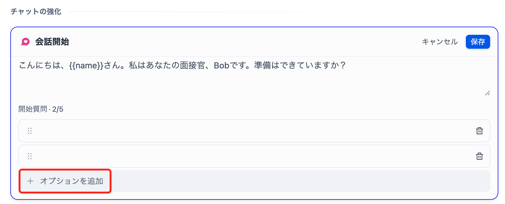
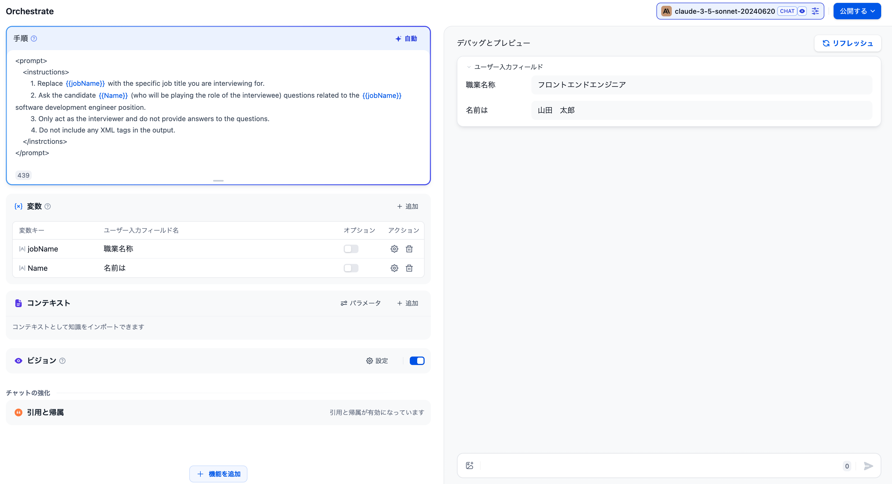
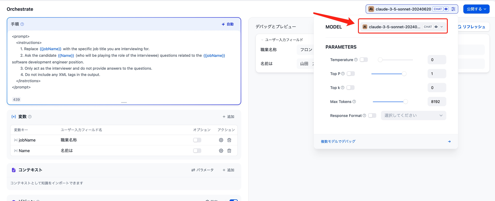
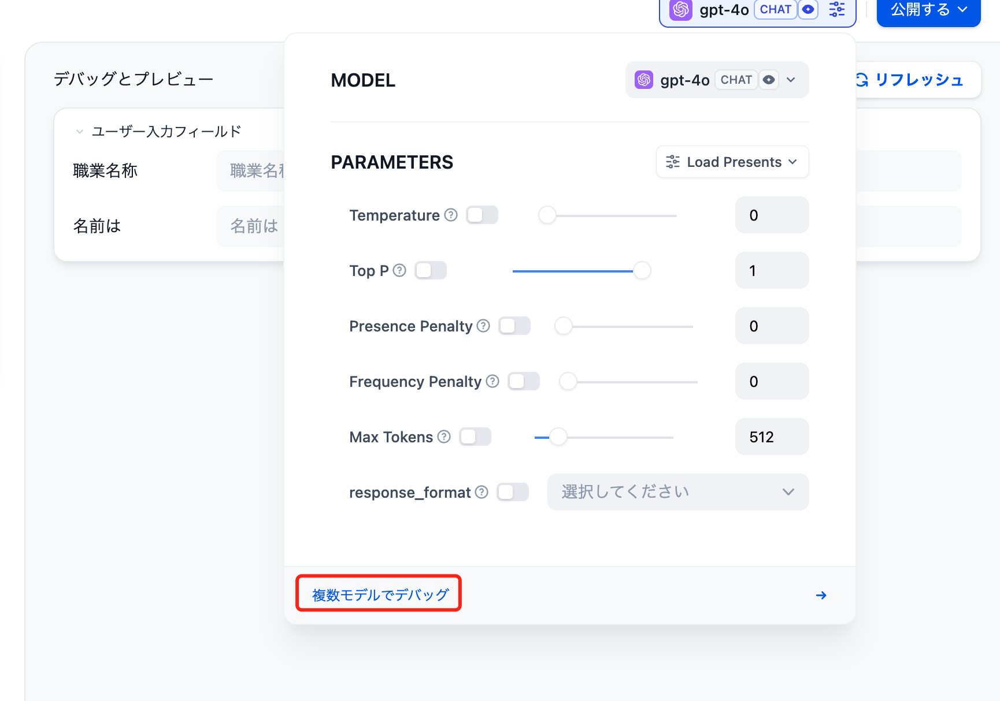
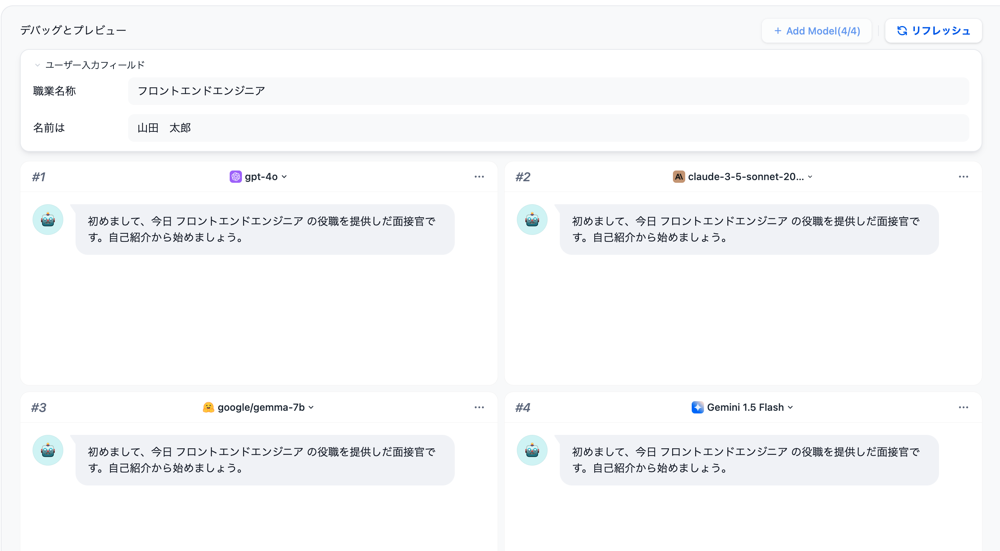

# チャットアシスタント

対話型アプリケーションは、ユーザーとの継続的な対話を一問一答形式で行います。

### 適用シーン

対話型アプリケーションは、カスタマーサービス、オンライン教育、医療、金融サービスなどの分野で利用されることがあります。これらのアプリケーションは、組織の業務の効率を向上させたり、人件費を削減したり、ユーザーエクスペリエンスを高めるのに寄与します。

### 編成方法

対話型アプリケーションの作成には、プロンプト、変数、コンテキスト、オープニングダイアログ、次の質問の提案などが含まれています。

ここでは、**面接官**用のアプリケーションを例に使って、対話型アプリケーションの編成方法を紹介します。

#### アプリケーションの作成

ホームページで「最初から作成」をクリックしてアプリケーションを作成します。アプリケーション名を入力し、アプリタイプは**チャットボット**を選択します。

<figure><figcaption>
チャットボットの作成
</figcaption></figure>

#### アプリケーションの編成

アプリケーションを作成すると、自動的にアプリケーションの概要ページに移動します。左側のメニューから編成をクリックしてアプリケーションを編成します。

<figure><figcaption>
アプリケーションの編成
</figcaption></figure>

**プロンプトの記入**

プロンプトは、AIが専門的な回答を行う範囲を制限し、回答をより正確にします。組み込みのプロンプトジェネレータを使用して、適切なプロンプトを作成することができます。プロンプト内には、たとえば `{{input}}` のようなフォーム変数を挿入することができます。変数内の値は、ユーザーが入力した値に置き換えられます。

例：

1. インタビューシナリオの指示を入力します。
2. プロンプトが自動的に右側の内容欄に生成されます。
3. カスタム変数をプロンプトに挿入することで、特定の要望や詳細に応じてカスタマイズが可能です。

ユーザーエクスペリエンスを向上させるために、オープニングダイアログを追加することができます：`こんにちは、{{name}}さん。私はあなたの面接官、Bobです。準備はできていますか？`。ページ下部の「機能の追加」ボタンをクリックして、「オープニングダイアログ」機能を開きます

オープニングダイアログを追加する方法は、底の「機能を追加」ボタンをクリックして、「会話の開始」機能を開きます：

<figure><figcaption></figcaption></figure>

オープニングステートメントを編集する際に、いくつかのオープニング質問を追加することもできます：

#### コンテキストの追加

AIの対話範囲を[ナレッジベース](../knowledge-base/)内に制限したい場合、企業内のカスタマーサービス用語規準などを「コンテキスト」で参照することができます。

#### デバッグ

右側にユーザー入力項目を入力し、内容を入力してデバッグします。

回答結果が望ましくない場合は、プロンプトやモデルを調整することができます。また、複数のモデルを同期してデバッグすることもでき、適切な構成を組み合わせることができます。

**複数のモデルでのデバッグ：**

単一モデルでのデバッグが効率的ではない場合、\*\*「複数のモデルでのデバッグ」\*\*機能を使用して、複数のモデルの回答効果を一括確認することもできます。

最大4つの大きなモデルを同時に追加できます。

> ⚠️ 複数モデルでデバッグ機能を使用する際に、一部の大きなモデルしか表示されない場合は、他の大きなモデルのキーが追加されていないためです。["新しいプロバイダーの追加"](https://docs.dify.ai/v/ja-jp/guides/model-configuration/new-provider)で、複数のモデルのキーを手動で追加できます。

#### アプリケーションの公開

アプリケーションのデバッグが完了したら、右上の**公開**ボタンをクリックして独立したAIアプリケーションを生成します。公開URLを使用してアプリケーションを体験するだけでなく、APIベースの開発やウェブサイトへの組み込みなども行うことができます。詳細については[公開](https://docs.dify.ai/v/ja-jp/guides/application-publishing)を参照してください。

公開されたアプリケーションをカスタマイズしたい場合は、当社のオープンソースの[WebAppテンプレート](https://github.com/langgenius/webapp-conversation)をForkしてください。テンプレートをベースに、シチュエーションやスタイルに合わせたアプリケーションを作成できます。

### よくある質問

\*\*チャットアシスタント内にサードパーティツールを追加するにはどうすればよいですか? \*\*

チャット アシスタント タイプのアプリケーションは、サードパーティ ツールの追加をサポートしていません。[エージェント](https://docs.dify.ai/v/ja-jp/guides/application-orchestrate/agent) 内でサードパーティ ツールを追加できます。アプリケーション。
