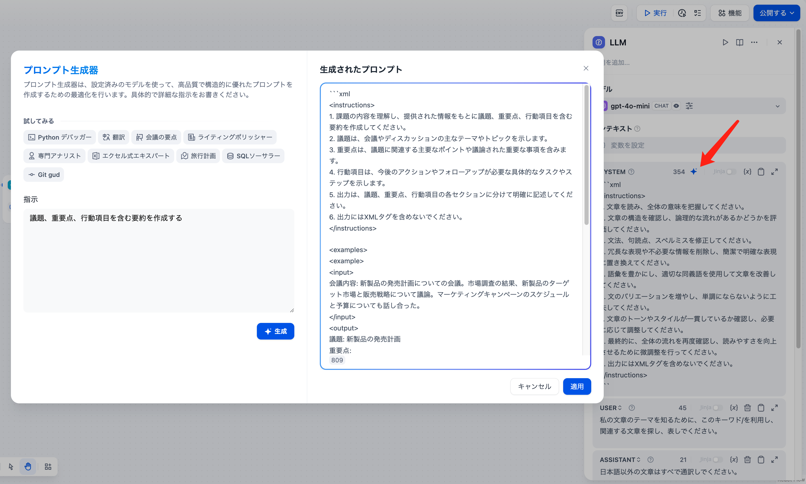

# LLM

### 定義

大規模言語モデルを活用して質問に回答したり、自然言語を処理したりします。

<figure><figcaption>
LLM ノード
</figcaption></figure>

***

### シナリオ

LLM は Chatflow/Workflow の中心的なノードであり、大規模言語モデルの会話/生成/分類/処理などの能力を活用して、多様なタスクを提示された指示に基づいて処理し、ワークフローのさまざまな段階で使用することができます。

* **意図識別**：カスタマーサービスの対話シナリオにおいて、ユーザーの質問を意図識別および分類し、異なるフローに誘導します。
* **テキスト生成**：記事生成シナリオにおいて、テーマやキーワードに基づいて適切なテキスト内容を生成するノードとして機能します。
* **内容分類**：メールのバッチ処理シナリオにおいて、メールの種類を自動的に分類します（例：問い合わせ/苦情/スパム）。
* **テキスト変換**：テキスト翻訳シナリオにおいて、ユーザーが提供したテキスト内容を指定された言語に翻訳します。
* **コード生成**：プログラミング支援シナリオにおいて、ユーザーの要求に基づいて指定のビジネスコードやテストケースを生成します。
* **RAG**：ナレッジベースの質問応答シナリオにおいて、検索した関連知識とユーザーの質問を再構成して回答します。
* **画像理解**：ビジョン能力を持つマルチモーダルモデルを使用し、画像内の情報を理解して質問に回答します。

適切なモデルを選択し、指示を記述することで、Chatflow/Workflow で強力で信頼性の高いソリューションを構築できます。

***

### 設定方法

<figure><figcaption>
LLM ノード設定 - モデル選択
</figcaption></figure>

**設定手順：**

1. **モデルを選択**：Dify は OpenAI の GPT シリーズ、Anthropic の Claude シリーズ、Google の Gemini シリーズなど、世界中の主要なモデルを[サポート](../../../getting-started/readme/model-providers.md)しており、モデルの選択は推論能力、コスト、応答速度、コンテキストウィンドウなどの要素に依存します。シナリオの要件とタスクの種類に応じて適切なモデルを選択する必要があります。
2. **モデルパラメータを設定**：モデルパラメータは生成結果を制御するために使用されます（例：温度、TopP、最大トークン、応答形式など）。システムは、創造性、バランス、正確さの3つのプリセットパラメータセットも提供しています。
3. **指示を記述**：LLM ノードは使いやすい指示の編成ページを提供しており、会話モデルや補完モデルを選択すると、それぞれ異なる指示の編成構造が表示されます。
4. **高度な設定**：記憶のオン/オフ、記憶ウィンドウの設定、Jinja-2 テンプレート言語を使用した複雑な指示などを設定できます。


初めて Dify を使用する場合、LLM ノードでモデルを選択する前に、**システム設定—モデルプロバイダー**内で[モデル設定](../../model-configuration/)を完了する必要があります。


#### **指示の記述**

LLM ノード内で、モデル入力指示をカスタマイズできます。会話モデル（Chat model）を選択した場合、システム指示（SYSTEM）/ユーザー（USER）/アシスタント（ASSISTANT）の3部分をカスタマイズできます。

<figure><figcaption></figcaption></figure>

#### **プロンプトジェネレーター**

システムプロンプトワード（SYSTEM）の作成時に良いアイデアがない場合は、プロンプトジェネレーター機能を使用して、AI 機能を利用して実際のビジネスシナリオに適したプロンプトワードを迅速に生成することもできます。

指示エディター内で、**“/”** または **“{”** を入力すると **変数挿入メニュー** が呼び出され、**特殊変数ブロック**や**上流ノード変数**を指示に挿入してコンテキスト内容として使用できます。

<figure><figcaption>
変数挿入メニューの呼び出し
</figcaption></figure>

***

### **特殊変数の説明**

**コンテキスト変数**

コンテキスト変数は LLM ノード内で定義された特殊な変数タイプで、外部から取得したテキスト内容を指示内に挿入するために使用されます。

<figure><figcaption>
コンテキスト変数
</figcaption></figure>

一般的なナレッジベースの質問応答アプリケーションでは、ナレッジベースの検索ノードの下流ノードは通常 LLM ノードです。知識検索の**出力変数** `result` は LLM ノード内の**コンテキスト変数**に関連付けて割り当てる必要があります。関連付けた後、指示の適切な位置に**コンテキスト変数**を挿入することで、外部から取得した知識を指示に挿入できます。

この変数は、LLM が質問に回答する際の指示コンテキストとして外部知識を導入するだけでなく、そのデータ構造に分段引用情報が含まれているため、アプリケーション側の[**引用と帰属**](../../knowledge-base/retrieval-test-and-citation.md#id-2-yin-yong-yu-gui-shu)機能もサポートします。


コンテキスト変数に上流ノードの通常の変数（例：開始ノードの文字列変数）を関連付けた場合、そのコンテキスト変数も外部知識として導入できますが、**引用と帰属**機能は無効になります。


**会話履歴**

テキスト補完モデル（例：gpt-3.5-turbo-Instruct）内でチャット型アプリケーションの対話記憶を実現するために、Dify は元の[プロンプト専門モード（廃止）](https://docs.dify.ai/v/ja-jp/learn-more/extended-reading/prompt-engineering/prompt-engineering)内で会話履歴変数を設計しました。この変数は Chatflow の LLM ノード内でも使用され、指示内に AI とユーザーの対話履歴を挿入して、LLM が対話の文脈を理解するのを助けます。


会話履歴変数の使用は広範ではなく、Chatflow 内でテキスト補完モデルを選択した場合にのみ使用できます。


<figure><figcaption>
会話履歴変数の挿入
</figcaption></figure>

***

### 高度な機能

**記憶**：記憶をオンにすると、問題分類器の各入力に対話履歴が含まれ、LLM が文脈を理解しやすくなり、対話の理解能力が向上します。

**記憶ウィンドウ**：記憶ウィンドウが閉じている場合、システムはモデルのコンテキストウィンドウに基づいて対話履歴の伝達数を動的にフィルタリングします。開いている場合、ユーザーは対話履歴の伝達数を正確に制御できます（対数）。

**対話役割名の設定**：モデルのトレーニング段階の違いにより、異なるモデルは役割名の指示遵守度が異なります（例：Human/Assistant、Human/AI、人間/助手など）。複数のモデルに対応するために、システムは対話役割名の設定を提供しており、対話役割名を変更すると会話履歴の役割プレフィックスも変更されます。

**Jinja-2 テンプレート**：LLM の指示エディター内で Jinja-2 テンプレート言語をサポートしており、Jinja2 の強力な Python テンプレート言語を使用して軽量なデータ変換やロジック処理を実現できます。詳細は[公式ドキュメント](https://jinja.palletsprojects.com/en/3.1.x/templates/)を参照してください。
