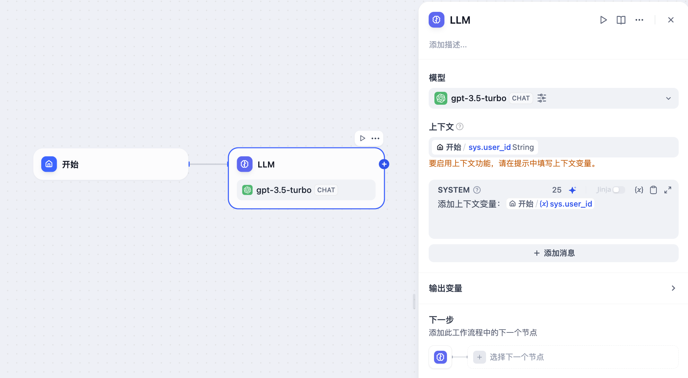
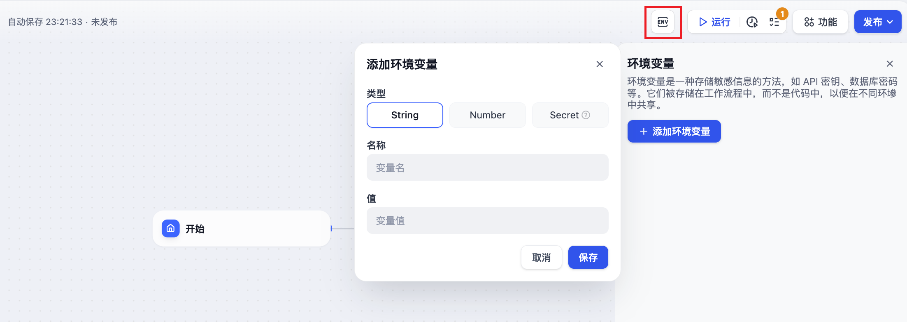

# 关键概念

### 节点

**节点是工作流的关键构成**，通过连接不同功能的节点，执行工作流的一系列操作。

工作流的核心节点请查看[节点说明](node/)。

***

### 变量

**变量用于串联工作流内前后节点的输入与输出**，实现流程中的复杂处理逻辑。

* 工作流需要定义启动执行变量，如聊天机器人需要定义一个输入变量 `sys.query`；
* 节点一般需要定义输入变量，如定义问题分类器的输入变量为 `sys.query`；
* 引用变量时只可引用流程上游节点的变量；
* 为避免变量名重复，节点命名不可重复；
* 节点的输出变量一般为系统固定变量，不可编辑。

### 环境变量

**环境变量用于保护工作流内所涉及的敏感信息**，例如运行工作流时所涉及的 API 密钥、数据库密码等。它们被存储在工作流程中，而不是代码中，以便在不同环境中共享。

支持以下三种数据类型：

* String 字符串
* Number 数字
* Secret 密钥

环境变量拥有以下特性：

* 环境变量可在大部分节点内全局引用；
* 环境变量命名不可重复；
* 环境变量为只读变量，不可写入；

### 会话变量

> 会话变量仅适用于 Chatflow 类型（聊天助手 → 工作流编排）应用。

**会话变量允许应用开发者在同一个 Chatflow 会话内，指定需要被临时存储的特定信息，并确保在当前工作流内的多轮对话内都能够引用该信息**，如上下文、上传至对话框的文件（即将上线）、 用户在对话过程中所输入的偏好信息等。好比为 LLM 提供一个可以被随时查看的“备忘录”，避免因 LLM 记忆出错而导致的信息偏差。

例如你可以将用户在首轮对话时输入的语言偏好存储至会话变量中，LLM 在回答时将参考会话变量中的信息，并在后续的对话中使用指定的语言回复用户。

<figure><figcaption></figcaption></figure>

**会话变量**支持以下六种数据类型：

* String 字符串
* Number 数值
* Object 对象
* Array\[string] 字符串数组
* Array\[number] 数值数组
* Array\[object] 对象数组

**会话变量**具有以下特性：

* 会话变量可在大部分节点内全局引用；
* 会话变量的写入需要使用[变量赋值](https://docs.dify.ai/v/zh-hans/guides/workflow/node/variable_assignment)节点；
* 会话变量为可读写变量；

关于如何将会话变量与变量赋值节点配合使用，请参考[变量赋值](https://docs.dify.ai/v/zh-hans/guides/workflow/node/variable_assignment)节点说明。

***

### Chatflow 和 Workflow

**应用场景**

* **Chatflow**：面向对话类情景，包括客户服务、语义搜索、以及其他需要在构建响应时进行多步逻辑的对话式应用程序。
* **Workflow**：面向自动化和批处理情景，适合高质量翻译、数据分析、内容生成、电子邮件自动化等应用程序。

**使用入口**

<figure><figcaption>
Chatflow 入口
</figcaption></figure>

<figure><figcaption>
Workflow 入口
</figcaption></figure>

**可用节点差异**

1. End 节点属于 Workflow 的结束节点，仅可在流程结束时选择。
2. Answer 节点属于 Chatflow ，用于流式输出文本内容，并支持在流程中间步骤输出。
3. Chatflow 内置聊天记忆（Memory），用于存储和传递多轮对话的历史消息，可在 LLM 、问题分类等节点内开启，Workflow 无 Memory 相关配置，无法开启。
4. Chatflow 的开始节点内置变量包括：`sys.query`，`sys.files`，`sys.conversation_id`，`sys.user_id`。Workflow 的开始节点内置变量包括：`sys.files`，`sys.user_id`
